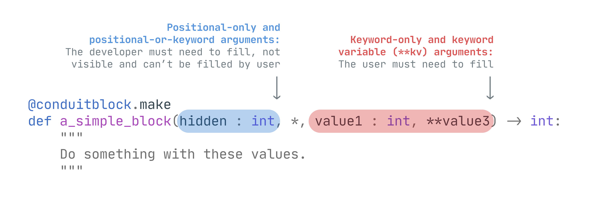

# Defining a Block

Defining a new block is same as creating a new function/method, but they are wrapped with [`@ConduitBlock.make`][pyconduit.block.ConduitBlock.make] decorator. 

```py
from pyconduit import ConduitBlock

@ConduitBlock.make
def a_simple_block():
    """
    Add some code here
    """
```

Conduit blocks allows the user to call itself by just providing its name and parameters remotely. They can send a payload like this to call this block:

```json
{
    "action": "A_SIMPLE_BLOCK",
    "parameters": {}
}
```

The `action` key is the name of the function that will be called. And `parameters` key is a dictionary of keyword arguments that will be passed to the function.

!!! note
    ConduitBlocks will always uppercase the category name and block name, so block names are **case insensitive**. Whenever the user types the block name in lowercase or uppercase, pyconduit will get the same block.

By default, when creating a new ConduitBlock, its name will be equal to the function name. However, you can set a custom name by setting `name` parameter. Also, providing a custom name allows you to use Python's reserved words.

```py
@ConduitBlock.make(name = "do_nothing")
def a_simple_block():
    """
    Add some code here
    """
```

---

## Categories

You can add blocks in their own categories, so you can group all related blocks in single place. To create a new category, create a new class that inherits from `ConduitCategory`.

```py
from pyconduit ConduitBlock, ConduitCategory

class MyBlocks(ConduitCategory):
    @ConduitBlock.make
    def a_simple_block():
        """
        Add some code here
        """
```

Created blocks in categories will have the category name in the block name joined with a dot "." character. So `A_SIMPLE_BLOCK` will become `MYBLOCKS.A_SIMPLE_BLOCK` anymore.

!!! warning
    ConduitBlocks are always static method even if they are in the `ConduitCategory`. Because `ConduitBlock` objects are designed to be independent, so when you search for a `MYBLOCKS.A_SIMPLE_BLOCK` block, you will directly get the block without needing to creating a instance of `MyBlocks` category.

    So when defining a new block, don't include `self` or `cls` parameter as ConduitBlock will think they are parameters that needs to be filled by user.

---

## Parameters

You can ask for a input from users by adding parameters to function. pyconduit uses function parameters in different way. Basically, positional parameters made for the developer and keyword parameters made for the users.



You can add annotations and default values like in classic Python function.

### Positional-only and positional-or-keyword arguments

These parameters indicates that they must be filled by developer. Users can't fill them (even if they type the parameter name in their payloads) or see its name. All positional arguments will be filled automatically when you add them to `global_values` parameter to [`Conduit`][pyconduit.conduit.Conduit] object.

```py
@ConduitBlock.make
def a_simple_block(hidden_number : int):
    pass

job = Conduit(global_values = {
    "hidden_number": 100
})
```

`hidden_number` will be passed to blocks if block contains a positional-only or positional-or-keyword argument with the same name.

[Read more about Global values](../locals_variables_globals#globals)

### Keyword-only and keyword-variable (**kwargs) arguments

These parameters indicates that they must be filled by user. When you add a keyword argument to block, it will be available for users.

```py
@ConduitBlock.make
def a_simple_block(*, visible_number : int):
    pass
```

Now, they can fill the `visible_number` parameter by adding it to `parameters` section of step.

```json
{
    "action": "A_SIMPLE_BLOCK",
    "parameters": {
        "visible_number": 100
    }
}
```

You can also add `**kwargs` to allow all parameters without any value checking.

```py
@ConduitBlock.make
def a_simple_block(**kwargs):
    pass
```

```json
{
    "action": "A_SIMPLE_BLOCK",
    "parameters": {
        "age": 18,
        "favourite_color": "Blue"
    }
}
```

You can mix positional and keyword arguments in the same method, they will work as expected.

!!! question "What will happen if I want to use same key for both positional and keyword argument?"
    You can add double underscore to the end of positional arguments and they won't get mixed with each other.
    [Read more in 'Locals, Variables & Globals'](../locals_variables_globals#using-same-parameter-name-for-both-arguments)

!!! question "Where is *args?"
    pyconduit ignores `*args` parameter it because it doesn't any make sense as positional parameters means for developer, not user. So there is no point to send all global variables to `*args` when calling the block.


### Enforcing parameter validation with pydantic

Parameter types will not be enforced as Python doesn't apply any type checking to functions by default, 
however if you install [pydantic](https://github.com/samuelcolvin/pydantic/){target=_blank} to your environment, pyconduit will apply pydantic's validator to all created blocks. 

You don't need to change any configuration to enable pydantic after installing it normally as pyconduit will automatically detect it.

---

## Advanced

You can add some settings to Conduit blocks such as limiting the maximum usage and setting tags.

### Limiting block max usage

If you want to apply a max usage limit (per job) for a specific block, you can use `max_uses` parameter when creating a block.

```py
@ConduitBlock.make(max_uses = 1)
def a_simple_block():
    """
    Add some code here
    """
```

Now users won't be able to call this block more than once per job. They can reference the block in payload more than once, however when job starts running, only first one will be executed.

```json
[
    {
        "action": "A_SIMPLE_BLOCK",
        "parameters": {}
    },
    {
        "action": "A_SIMPLE_BLOCK",
        "parameters": {}
    }
]
```

If you want to override the block usage limit for a specific job, you can use `block_limit_overrides` dictionary. You need to just type the display name of the block along with its new limit.

```py
job = Conduit(
    block_limit_overrides = {
        "A_SIMPLE_BLOCK": 5
    }
)
```

You can also set it to `None` for removing the limit (unlimited).

### Denying / allow access with tags

If you add tags a block, then the job must contain these tags in order to call it. Having extra tags in the job doesn't matter. It can be useful if you want to allow some special blocks only for people who you specified. 

```py
@ConduitBlock.make(tags = ["STAFF_ONLY"])
def get_user_info():
    """
    Add some code here
    """

@ConduitBlock.make(tags = ["MODERATORS_ONLY"])
def ban_user():
    """
    Add some code here
    """

job = Conduit(tags = ["STAFF_ONLY", "MODERATORS_ONLY"])
```